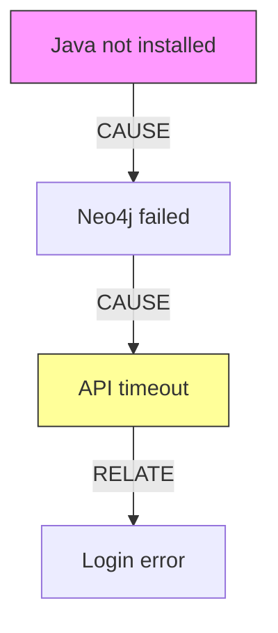

# MemOS 路线图

> **Version:** 2.0
> **Updated:** 2026-02-02
> **Status:** Active Development

---

## 已实现功能 (Completed)

### Core Memory System

| Feature | Status | Description |
|---------|--------|-------------|
| `memos_search` | ✅ 已实现 | 关键词搜索项目记忆 |
| `memos_search_context` | ✅ 已实现 | 上下文感知搜索，分析对话历史 |
| `memos_save` | ✅ 已实现 | 保存记忆，支持显式类型指定 |
| `memos_list` / `memos_list_v2` | ✅ 已实现 | 列出记忆，支持类型过滤 |
| `memos_suggest` | ✅ 已实现 | 智能搜索建议 |
| `memos_get_stats` | ✅ 已实现 | 记忆统计 + 健康警告 |

### Knowledge Graph

| Feature | Status | Description |
|---------|--------|-------------|
| `memos_get_graph` | ✅ 已实现 | 查询知识图谱关系 (CAUSE/RELATE/CONFLICT) |
| `memos_trace_path` | ✅ 已实现 | 追踪两个节点间的推理路径 |
| `memos_export_schema` | ✅ 已实现 | 导出图谱结构和统计信息 |
| Neo4j 集成 | ✅ 已实现 | tree_text 模式的知识图谱后端 |

### Admin & Cube Management

| Feature | Status | Description |
|---------|--------|-------------|
| `memos_list_cubes` | ✅ 已实现 | 列出所有可用的记忆立方体 |
| `memos_register_cube` | ✅ 已实现 | 手动注册立方体 |
| `memos_create_user` | ✅ 已实现 | 创建 MemOS 用户 |
| `memos_validate_cubes` | ✅ 已实现 | 验证并修复立方体配置 |
| `memos_delete` | ✅ 已实现 | 删除记忆 (默认禁用) |
| Auto-registration | ✅ 已实现 | 首次使用时自动注册立方体 |

### Memory Type System

| Feature | Status | Description |
|---------|--------|-------------|
| 9 种记忆类型 | ✅ 已实现 | ERROR_PATTERN, BUGFIX, DECISION, GOTCHA, CODE_PATTERN, CONFIG, FEATURE, MILESTONE, PROGRESS |
| 置信度检测 | ✅ 已实现 | `detect_memory_type()` 返回类型和置信度 |
| 强制显式类型 | ✅ 已实现 | 低置信度 PROGRESS 拒绝保存，要求显式指定 |
| 健康警告 | ✅ 已实现 | PROGRESS 占比 >70% 时输出警告 |

### MCP Server Architecture

| Feature | Status | Description |
|---------|--------|-------------|
| 模块化重构 | ✅ 已实现 | 从 2767 行拆分为 15 个模块 |
| Handler 分离 | ✅ 已实现 | search.py, memory.py, graph.py, admin.py |
| 关键词增强 | ✅ 已实现 | keyword_enhancer.py |
| 重试逻辑 | ✅ 已实现 | api_call_with_retry() |

---

## 进行中 (In Progress)

### Skill Triggering System

| Feature | Status | Description |
|---------|--------|-------------|
| Skill 知识库构建 | 🔄 规划中 | 索引 200+ skill 元数据 |
| UserPromptSubmit Hook | 🔄 规划中 | 基于用户输入推荐 skill |
| 学习反馈系统 | 🔄 规划中 | 根据用户接受/忽略调整权重 |

详见: [SKILL_TRIGGER_SYSTEM_PLAN.md](./SKILL_TRIGGER_SYSTEM_PLAN.md)

---

## 未来规划 (Future)

### Phase 5: 时间维度查询 (Time-Aware Search)

**目标**: 支持基于时间范围的记忆检索

| Feature | Priority | Description |
|---------|----------|-------------|
| 时间范围查询 | High | `memos_search(query, time_range="last_week")` |
| 时间线视图 | Medium | 按时间排序展示记忆演进 |
| 版本对比 | Medium | 对比不同时间点的决策/配置变化 |
| 周期性摘要 | Low | 自动生成日/周/月记忆摘要 |

**API 设计**:
```python
memos_search(
    query="authentication",
    time_range="2026-01-01..2026-02-01",  # 时间范围
    time_filter="recent_first",           # 排序方式
    include_timeline=True                  # 返回时间线
)
```

**预期效果**:
```
📅 Timeline: "authentication"
├─ 2026-02-01: [BUGFIX] Fixed JWT token expiration issue
├─ 2026-01-28: [DECISION] Chose OAuth2 over session-based auth
├─ 2026-01-25: [CONFIG] Updated auth timeout to 30 minutes
└─ 2026-01-20: [FEATURE] Implemented login module
```

---

### Phase 6: 内嵌图谱可视化 (Embedded Graph Visualization)

**目标**: 不依赖 Neo4j 浏览器，在项目内部展示知识图谱

| Feature | Priority | Description |
|---------|----------|-------------|
| Mermaid 图谱生成 |  High | 自动生成 Mermaid 语法的关系图 |
| D3.js 可视化组件 | Medium | 交互式 Web 图谱组件 |
| ASCII 图谱 | Medium | 终端友好的文本图谱展示 |
| 图谱导出 | Low | 导出为 PNG/SVG/JSON |

**API 设计**:
```python
memos_visualize_graph(
    query="error handling",
    format="mermaid",        # mermaid | d3 | ascii | json
    depth=3,                 # 关系深度
    max_nodes=20             # 最大节点数
)
```

**预期输出 (Mermaid)**:


**预期输出 (ASCII)**:
```
┌─────────────────────┐
│ Java not installed  │
└──────────┬──────────┘
           │ CAUSE
           ▼
┌─────────────────────┐
│   Neo4j failed      │
└──────────┬──────────┘
           │ CAUSE
           ▼
┌─────────────────────┐
│    API timeout      │
└─────────────────────┘
```

---

### Phase 7: 主动触发增强 (Proactive Triggering 2.0)

**目标**: 更智能的记忆检索触发机制

| Feature | Priority | Description |
|---------|----------|-------------|
| 错误模式自动匹配 |  High | 检测到 Exception 时自动搜索 ERROR_PATTERN |
| 文件变更触发 | High | 编辑文件时自动搜索相关 GOTCHA |
| 代码模式建议 | Medium | 识别代码结构，推荐 CODE_PATTERN |
| 决策提醒 | Medium | 修改架构时提醒相关 DECISION |
| 依赖分析触发 | Low | 修改依赖时自动检索配置变更历史 |

**触发规则配置**:
```json
{
  "proactive_triggers": {
    "on_error": {
      "enabled": true,
      "patterns": ["Exception", "Error", "Failed", "错误"],
      "search_types": ["ERROR_PATTERN", "BUGFIX"],
      "max_results": 3
    },
    "on_file_edit": {
      "enabled": true,
      "file_patterns": ["*.config.*", "*.env", "docker-compose.*"],
      "search_types": ["CONFIG", "GOTCHA"],
      "max_results": 2
    },
    "on_code_pattern": {
      "enabled": true,
      "detect_patterns": ["authentication", "database", "api"],
      "search_types": ["CODE_PATTERN", "DECISION"],
      "max_results": 3
    }
  }
}
```

**预期行为**:
```
User: "修复这个 ModuleNotFoundError"

🔍 自动检索相关记忆...
━━━━━━━━━━━━━━━━━━━━━━━━━━━━━━━━━━━━━━━━
💡 Found 2 relevant ERROR_PATTERN memories:

1. [ERROR_PATTERN] ModuleNotFoundError: uvicorn
   Solution: pip install uvicorn[standard]
   Confidence: 92%

2. [ERROR_PATTERN] ModuleNotFoundError in Docker
   Solution: Add to requirements.txt before build
   Confidence: 78%
━━━━━━━━━━━━━━━━━━━━━━━━━━━━━━━━━━━━━━━━
```

---

### Phase 8: 海量数据精确查询 (Precision at Scale)

**目标**: 减少噪音，降低 Token 消耗，提高检索精度

| Feature | Priority | Description |
|---------|----------|-------------|
| 分层检索 |  High | 先粗筛再精排，减少 LLM 调用 |
| 摘要压缩 | High | 长记忆自动生成摘要，减少 Token |
| 相关性阈值 | High | 动态调整返回结果的相关性门槛 |
| 去重合并 | Medium | 合并相似记忆，避免重复 |
| 增量索引 | Medium | 只索引变更部分，提高效率 |
| Token 预算 | Low | 设置最大 Token 预算，自动裁剪 |

**API 设计**:
```python
memos_search(
    query="database optimization",
    precision_mode="high",           # high | balanced | recall
    max_tokens=2000,                 # Token 预算
    dedup_threshold=0.85,            # 去重阈值
    summary_mode="auto"              # auto | full | none
)
```

**分层检索架构**:
```
User Query
    │
    ▼
┌─────────────────────────────────┐
│  Layer 1: Keyword Index (Fast)  │  ← 毫秒级，筛选 1000→100
│  - BM25 / TF-IDF                │
│  - Inverted Index               │
└───────────────┬─────────────────┘
                │
                ▼
┌─────────────────────────────────┐
│  Layer 2: Vector Search         │  ← 百毫秒级，100→20
│  - Qdrant Semantic              │
│  - Embedding Similarity         │
└───────────────┬─────────────────┘
                │
                ▼
┌─────────────────────────────────┐
│  Layer 3: Graph Context         │  ← 秒级，20→5
│  - Neo4j Relationships          │
│  - Path Relevance               │
└───────────────┬─────────────────┘
                │
                ▼
┌─────────────────────────────────┐
│  Layer 4: LLM Rerank (Optional) │  ← 可选，5→3
│  - Semantic Reranking           │
│  - Context Fitting              │
└─────────────────────────────────┘
```

**Token 节省预估**:

| 场景 | 当前 Token | 优化后 Token | 节省 |
|------|------------|--------------|------|
| 简单查询 | ~800 | ~300 | 62% |
| 复杂查询 | ~3000 | ~1200 | 60% |
| 海量数据 | ~10000 | ~2000 | 80% |

---

### Phase 9: 自动关系发现 (Auto Relationship Discovery)

**目标**: 自动发现和建立记忆节点间的关系

| Feature | Priority | Description |
|---------|----------|-------------|
| 因果推断 |  High | 自动识别 A 导致 B 的关系 |
| 时间序列关联 | High | 时间相近的记忆自动关联 |
| 实体链接 | Medium | 识别相同实体的不同引用 |
| 冲突检测 | Medium | 自动发现矛盾的决策/配置 |
| 依赖图构建 | Low | 基于代码分析构建依赖关系 |

**自动关系类型**:

```cypher
// 因果关系 - 基于时间和内容分析
(error:BUGFIX)-[:CAUSED_BY]->(config:CONFIG)

// 演进关系 - 同一主题的版本演进
(v1:DECISION)-[:EVOLVED_TO]->(v2:DECISION)

// 冲突关系 - 矛盾的配置或决策
(a:CONFIG)-[:CONFLICTS_WITH]->(b:CONFIG)

// 依赖关系 - 代码/模块依赖
(module_a:FEATURE)-[:DEPENDS_ON]->(module_b:FEATURE)

// 解决关系 - 错误与修复的对应
(error:ERROR_PATTERN)-[:RESOLVED_BY]->(fix:BUGFIX)
```

**自动发现算法**:

```python
async def discover_relationships(memory_id: str) -> List[Relationship]:
    """
    自动发现新记忆与现有记忆的关系

    1. 时间窗口分析: 查找时间相近的记忆
    2. 语义相似度: 查找内容相似的记忆
    3. 实体提取: 识别共同的实体引用
    4. 因果模式: 识别 "因为...所以..." 模式
    5. 冲突检测: 识别矛盾的陈述
    """

    relationships = []

    # 时间窗口内的记忆
    nearby = await find_memories_in_timewindow(memory_id, hours=24)
    for m in nearby:
        if similarity(memory_id, m) > 0.7:
            relationships.append(Relationship(
                source=memory_id,
                target=m,
                type="RELATE",
                confidence=0.8
            ))

    # 因果模式检测
    content = await get_memory_content(memory_id)
    if contains_causal_pattern(content):
        cause = extract_cause(content)
        effect = extract_effect(content)
        # 在图谱中查找匹配的节点
        cause_node = await find_matching_node(cause)
        if cause_node:
            relationships.append(Relationship(
                source=cause_node,
                target=memory_id,
                type="CAUSE",
                confidence=0.85
            ))

    return relationships
```

**预期效果**:
```
新保存记忆: [BUGFIX] Fixed database connection timeout

🔗 自动发现关系:
├─ CAUSED_BY: [CONFIG] Updated database pool size (2 hours ago)
├─ RELATE: [ERROR_PATTERN] Connection timeout in production (similarity: 89%)
└─ RESOLVED_BY: [GOTCHA] Remember to restart after config change
```

---

### Phase 10: 多模态记忆 (Multimodal Memory)

**目标**: 支持图片、代码片段、架构图等多模态内容

| Feature | Priority | Description |
|---------|----------|-------------|
| 代码片段存储 | High | 保存带语法高亮的代码块 |
| 架构图存储 | Medium | 存储和检索 Mermaid/PlantUML 图 |
| 截图引用 | Medium | 记忆关联截图文件 |
| 文件附件 | Low | 记忆关联配置文件等附件 |

**API 设计**:
```python
memos_save(
    content="Fixed layout issue in App.vue",
    memory_type="BUGFIX",
    attachments=[
        {
            "type": "code",
            "language": "vue",
            "content": "<template>...</template>"
        },
        {
            "type": "image",
            "path": "docs/ScreenShot/fix-demo.png"
        }
    ]
)
```

---

## 技术债务 (Tech Debt)

| Item | Priority | Description |
|------|----------|-------------|
| 测试覆盖率 | High | 增加单元测试和集成测试 |
| 文档完善 | Medium | API 文档和使用示例 |
| 性能监控 | Medium | 添加性能指标收集 |
| 错误处理 | Low | 统一错误响应格式 |

---

## 版本规划

| Version | Target Date | Key Features |
|---------|-------------|--------------|
| v1.0 | ✅ 2026-02-02 | Core memory system, graph tools, modular architecture |
| v1.1 | 2026-02-15 | Time-aware search, basic visualization |
| v1.2 | 2026-03-01 | Proactive triggering 2.0, precision at scale |
| v2.0 | 2026-04-01 | Auto relationship discovery, skill triggering |
| v2.5 | 2026-06-01 | Multimodal memory, full visualization |

---

## 贡献指南

### 添加新功能

1. 在此文档中添加功能规划
2. 创建设计文档于 `docs/future/`
3. 实现并提交 PR
4. 更新此文档状态为 ✅

### 优先级定义

| Priority | Description |
|----------|-------------|
|  High | 核心功能，影响用户体验 |
| Medium | 重要功能，可以延后 |
| Low | Nice to have |

---

**Document Owner:** MemOSlocal Team
**Last Review:** 2026-02-02
**Next Review:** 2026-02-15
